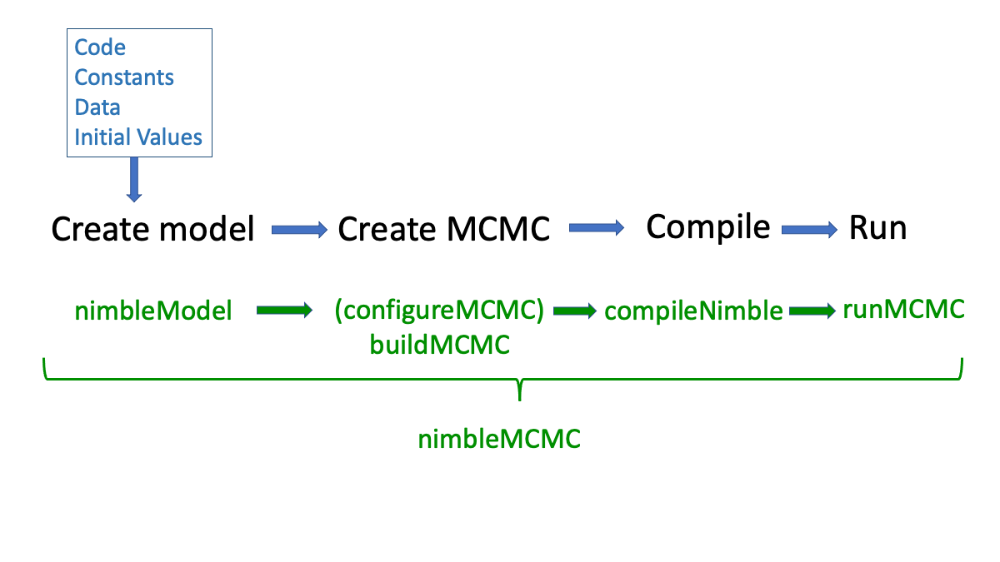

```{css, echo = FALSE}
h1, h4.author, h4.date {
  text-align: center;
}
```

```{r setup, include=FALSE, echo = FALSE}
knitr::opts_chunk$set(echo = TRUE)

knitr_opts <- list(
  message = FALSE,
  warning = FALSE,
  collapse = TRUE,
  comment = "#>",
  fig.width = 7,
  dpi = 300,
  out.width = "700px",
  fig.asp = 1 / 1.618,
  cache = FALSE,
  autodep = TRUE,
  cache.comments = TRUE,
  fig.align = "center",
  echo = TRUE,
  results = 'hide',
  eval = FALSE
)
do.call(knitr::opts_chunk$set, knitr_opts)
```

## What Is NIMBLE?

- A framework for hierarchical statistical models and methods.
- An extension of the BUGS/JAGS language for:

    - writing new functions and distributions using **nimbleFunctions**
    - named alternative parameterizations (e.g. sd vs precision for `dnorm`).
    - Additional R-like coding, including vectorized declarations.
    
- A configurable system for MCMC.
- A model-generic programming system to write new analysis methods using (two-stage) nimbleFunctions.
- A growing library of other methods.
- A growing package ecosystem of other methods.
- **N**umerical **I**nference for statistical **M**odels using **B**ayesian and **L**ikelihood **E**stimation.

## The WinBUGS/OpenBUGS/JAGS language has made a huge impact on applied Bayesian statistics.


## Methods in NIMBLE beyond basic MCMC:

- Hamiltonian Monte Carlo (MCMC) (package *nimbleHMC*).
- Sequential Monte Carlo (aka particle filtering) and Particle MCMC (package *nimbleSMC*).
- Laplace approximation and adaptive Gauss-Hermite quadrature (for maximum likelihood, included in *nimble* for now, to be moved to *nimbleQuad* soon!).
- Coming soon: methods related to Integrated Nested Laplace Approximation (INLA).
- Monte Carlo Expectation Maximization (MCEM, for maximum liklihood) (included in *nimble*).
- Reversible Jump MCMC (RJMCMC) for variable selection (included in *nimble*).
- Marginal distributions for ecological models (capture-recapture, occupancy, dynamic occupancy, N-mixture, Hidden Markov models) (package *nimbleEcology*).
- Functions and distributions for spatial capture-recapture (package *nimbleSCR*).
- Conditional autoregressive (CAR) spatial models (included in *nimble*).
- Bayesian non-parametric (BNP) distributions (included in *nimble*).
- Non-stationary Gaussian processes (package *NSGP*).

## NIMBLE Code and Model:

The first stage of writing a model in nimble is defining the model via nimble code. This code is written in the BUGS language and is defined as `nimbleCode`. We can define a random node as `~` with a distribution that is defined starting with a `d` similar to R. 

Key distributions and their parameters (See https://r-nimble.org/html_manual/cha-RCfunctions.html#sec:nimble-dist-funs)

- `dnorm(x, mean, tau)` Normal distribution, can also write in terms of precision `sd = 1/sqrt(tau)`.
- `dlnorm(x, meanlog, sdlog)` Log normal defined by mean and standard deviation on log scale.
- `dgamma(x, shape, rate)` Gamma distribution, can also write in terms of `scale = 1/rate`.
- `dinvgamma(x, shape, rate)` Inverse gamma distribution, can also write in terms of `scale = 1/rate`.
- `dpois(x, lambda)` Poisson distribution with mean/rate `lambda`.
- `dbinom(x, size, prob)` Binomial distribution.
- `dnbinom(x, size, prob)` Negative binomial distribution.
- `ddirch(x, alpha)` Dirichlet distribution.
- `dcat(x, prob)` Categorical distribution.


```{r}
library(nimble)
example <- nimbleCode({
  for( i in 1:200 ){
    x[i] ~ dnorm(0, 1)  ## Try another distribution here.
  }
})
mod <- nimbleModel(example)
mod$calculate()

mod$getNodeNames(dataOnly = TRUE)
mod$simulate("x")
mod$setData("x")
mod$getNodeNames(dataOnly = TRUE)[1:10]

mod$calculate()

mod$simulate()
hist(mod$x, freq = FALSE)

## Let's find the log likelihood for all values.
x <- seq(-3, 3, by = 0.1)
logf <- NULL
for( i in seq_along(x) )
{
  mod$x[1] <- x[i]  ## Change data value.
  logf <- c(logf, mod$calculate("x[1]"))  ## Log density of node `x[1]`.
}
lines(x, exp(logf), col = "red")
```

Key input for a `nimbleModel` is the `nimbleCode`, `constants`, `data`, and `inits`. Above, no constants are required, and we don't initialize anything. No data is provided and as a result, the model calculates `NA` log density until we simulate. 

All of this computation is done in R. We can compile all nimble functions into C++ via `compileNimble`.

```{r}
## Will remove data to sample it via MCMC later.
mod$resetData()

cmod <- compileNimble(mod)
cmod$simulate()
cmod$calculate()  ## Calculate all.
cmod$getLogProb() ## Doesn't recompute, just fetches.

## Get log probs as a vector:
cmod$logProb_x[1:10]
```

### Constants are values needed to define model relationships

- Starting or ending of index ranges, like `N` in "`for(i in 1:N)`".
- Constant index vectors like "`group`" in "`x[i] ~ dnorm(mu[group[i]], sd = sigma)`".
- (If you provide an index vector in the `data` list instead of the `constants` list, nimble will think its value might change, and that will make calculations very inefficient. **Constant index vectors should be provided in the `constants` list, not the `data` list.** )
- Constants must be provided when creating a model with `nimbleModel` (or calling `nimbleMCMC`).

### Data represents a flag on the role a parameter (node) plays in the model

- Stochastic nodes may be unobserved or observed (i.e. **data**).
- Algorithms can handle data nodes as needed. e.g., data nodes won't be sampled in MCMC.
- Data *values* can be changed. E.g. you could analyze multiple data sets with the same model object (without rebuilding and recompiling).
- Data can be provided when calling `nimbleModel` or later.

### Providing data and constants together.

- Data and constants can be provided together **in the `constants` list**.
- NIMBLE will usually disambiguate data when it is provided in the constants list.

### What are covariates and other non-parameters/non-observations?

- Covariates/predictors are neither parameters nor data in the sense of the likelihood.
- Covariates/predictors can be provided via `constants` if you don't need to change them (often the case).
- Covariates/predictors can be provided via `data` or `inits` if you want to change them.
    - NIMBLE will not treat them as 'data nodes'.

### Explicit about Dimensions

Dimensions must always be written explicitly

- Square brackets and commas indicate number of dimensions

    - If `x` is 2-dimensional, use "`x[1:N,1:p] %*% beta[1:p]`" or "`x[,] %*% beta[]`", not "`x %*% beta"`
    - "`x[,] %*% beta[]`" works if nimbleModel can determine the sizes from other declarations *or* if the `dimensions` argument is provided to `nimbleModel`. Example: "`dimensions = list(x = c(N, p))`".

### Defining the MCMC

The next step once we have defined a model and compiled it into C++ is to define the MCMC. We first configure the MCMC. By default it will work through the stochastic nodes that aren't actually observed and assign samplers. We will then build the MCMC which creates the nimble functions required to run the MCMC based on the chosen samplers. The MCMC can then be run in R or C++. Once we run our MCMC we can access the sampled values with the mcmc object via `mvSamples`.

```{r}
conf <- configureMCMC(mod)
conf$printSamplers()
mcmc <- buildMCMC(conf)
mcmc$run(100)
cmcmc <- compileNimble(mcmc)  ## Must have model compiled too.
cmcmc$run(100)

samples <- as.matrix(cmcmc$mvSamples)
hist(samples[,'x[3]'])
```



## Example: Salmon Stock Recruit Models

In the following example, we will run different versions of a linear model, learn about some nimble specific code to help us along the way, and then add some random effects, and temporal autocorrelation.

We consider spawner counts of Fraser River sockeye salmon. Recruits are estimated as the spawners plus the total catch of that brood year. For sockeye, this means adding years 3-7 recruits. We will start with Early Stuart sockeye as the example but combine multiple stocks as we progress. 

```{r, eval = TRUE}
library(tidyverse)
library(readxl)
sockeye <- read_excel("data/Production Data_Detailed Format.xlsx")
stockid <- "Stellako"
sox <- sockeye %>% 
  filter(production_stock_name == stockid) %>%
  group_by(broodyr, total_broodyr_spawners) %>%
  summarize(recruits=sum(num_recruits), .groups = "drop") %>%
  rename(broodyear = broodyr, spawners = total_broodyr_spawners) %>%
  mutate(logRS = log(recruits) - log(spawners)) %>%
  filter(!is.na(spawners) & !is.na(recruits)) %>%
  mutate(scale = 10^floor(log10(max(spawners))))

spscale <- sox$scale[1]

ggplot(sox, aes(x = spawners/spscale, recruits/spscale)) +
  geom_point() + 
  theme_bw() +
  xlab(paste0("Spawners (x ", spscale, ")")) + ylab(paste0("Recruits (x ", spscale, ")")) +
  ggtitle(stockid)

ggplot(sox, aes(x = broodyear, spawners/1000)) +
  geom_line() + 
  theme_bw() +
  xlab("Brood Year") + ylab(paste0("Spawners (x ", spscale, ")")) +
  ggtitle(stockid)

```

For a Ricker stock recruit model, the parameters are $r = \mbox{log}(\alpha)$, where $\alpha$ is the maximum recruits per spawner, and $E$, the unfished equilibrium population size (carrying capacity). For brood year $i$, $S_i$ spawners generate $R_i$ recruits. Combining both any process and observation noise, $w_{i} \sim N(0,\sigma)$,

\[
  R_i = S_i \mbox{exp}\Big(r \big(1-\frac{S_i}{E}\big) + w_i\Big).
\]

We will then rewrite this as linear model, $y_i = log(R_i/S_i)$,

\[
  y_i = r \big(1-\frac{S_i}{E}\big) + w_i.
\]

Now let's program our first NIMBLE model. Here is where you get to choose how you want to name things in your code that will be obvious to you and others. For example, the number of observations may be `n` or `nobs`.

Let's think about some prior distributions. The error term, $\sigma$, is likely relatively small given that it's error on the scale of $log(R/S)$, but it is strictly positive. Log productivity $r$, `logalpha`, is not constrained but likely not mean 0. We may expect it to be around 1.5 on the log scale, but with very high uncertainty. The challenging term here is $E$, as it is potentially very large. We may scale $R$ and $S$ in advance or just work on the large scale, but our prior must reflect that it could be very large.

```{r, eval = TRUE}
library(nimble)
sox_model_code_1 <- nimbleCode({
  # Priors
  logalpha ~ dunif(0, 10)
  sigma ~ dunif(0, 10)
  E ~ dhalfflat() ## This is potentially a really big number.
  
  # Likelihood:
  for( i in 1:nobs ){
    mean_logRS[i] <- logalpha*(1-S[i]/E)
    logRS[i] ~ dnorm(mean_logRS[i], sd = sigma)
  }
})
``` 

To turn code into an object, we need to provide some combination of:

- `constants` (like `nobs`)
- `data` (like `logRS`)
- `inits` (initial values for any parameters or states)

```{r}
model <- nimbleModel(sox_model_code_1,
                     constants = list(nobs = nrow(sox), S = sox$spawners/spscale),
                     data = list(logRS = sox$logRS),
                     inits = list(sigma = 1, logalpha = 2, E = 10))
```

We can interact with our model and run it directly in R. First we'll need to give it some initial values. If we want the model to save the values and then update, we can use `calculate` to actually run the model and return the log posterior density.

```{r, echo = FALSE, eval = FALSE}
## Secret example of a basic MLE in NIMBLE
fn <- function(pars){
  model$logalpha <- pars[1]
  model$E <- exp(pars[2])    
  model$sigma <- exp(pars[3])
  calcNodes <- model$getDependencies(c("sigma", "logalpha", "E"), self= FALSE)  ## Exclude priors.
  -model$calculate(calcNodes)
}
fit.nim <- optim(c(1.5, 2, log(0.5)), fn) ## Slow as model not compiled into C++
fit.nim$par 
```

```{r}
fit.lm <- lm(logRS ~ I(spawners/spscale), data = sox)
logalpha.lm <- as.numeric(coef(fit.lm)[1])
E.lm <- as.numeric(logalpha.lm/abs(coef(fit.lm)[2]))
sigma.lm <- sigma(fit.lm)

model$logalpha <- logalpha.lm
model$E <- E.lm
model$sigma <- sigma.lm
model$calculate()
```

Now let's simulate some new data given these parameters. This might be a good way to perform prior checks, or to just make sure your model makes sense.

```{r}
param_nodes <- c("logalpha", "E", "sigma")
sim_nodes <- model$getDependencies(param_nodes, self = FALSE)
model$simulate(sim_nodes, includeData = TRUE)
plot(model$logRS, sox$logRS, xlab = "Simulated Data", ylab = "Original Data")
## ***Better reset the data***
model$logRS <- sox$logRS
model$calculate()
```

Let's play around with our model object.

```{r}
model$mean_logRS[1:3]

model$getLogProb()
model$getLogProb("logRS") ## Data log likelihood
model$getLogProb("logRS[1]")  ## First observation
model$logProb_logRS[1]

model$getDependencies("sigma", self = FALSE)

## Param nodes:
model$getParents("logRS[1]", self = FALSE, stochOnly = TRUE)

model$getParam("logRS[1]", "mean")
model$mean_logRS[1]
```

Order of the code doesn't matter. The model below is exactly the same as above. Note that we also didn't define the mean explicitly, but put it within the distribution. NIMBLE will lift the node in the background making model code below precisely the same as above but with different internal naming.

```{r}
nimbleCode({
  # Likelihood:
  for( i in 1:nobs ){
    logRS[i] ~ dnorm(logalpha*(1-S[i]/E), sd = sigma)
  }

  # Priors
  logalpha ~ dunif(0, 10)
  sigma ~ dunif(0, 10)
  E ~ dhalfflat()
})
```

We can now fit our first model. It will compile the model into C++, then define the MCMC, compile that into C++, and then finally run the MCMC.

```{r}
samples <- nimbleMCMC(model = model)
```

This is where NIMBLE "officially" stops. It's up to you to process the posterior and assess it. A common package is `coda` that nimble includes in its dependencies.

```{r}
library(coda)
samples <- coda::mcmc(samples)
plot(samples[, "E"])
```

***Discussion*** Doe `E` look like it has mixed well? What should we do? Prior distributions? Is this a problem with the model or the MCMC?


It probably makes sense to put a proper prior on $E$. Maybe a good place to start is a log-normal prior on $E$ which is equivalent to a normal prior on $log(E)$. What mean and variance should we choose?

```{r}
sox_model_code_2a <- nimbleCode({
  # Priors
  logalpha ~ dunif(0, 10)
  sigma ~ dunif(0,10)
  logE ~ dnorm(2, sd = 5)
  E <- exp(logE)

  # Likelihood:
  for( i in 1:nobs ){
    mean_logRS[i] <- logalpha*(1-S[i]/E)
    logRS[i] ~ dnorm(mean_logRS[i], sd = sigma)
  }
})
model <- nimbleModel(sox_model_code_2a,
                    constants = list(nobs = nrow(sox), S = sox$spawners/spscale),
                    data = list(logRS = sox$logRS),
                    inits = list(logalpha = 1.5, logE = log(100), sigma = 0.5))
  
samples <- nimbleMCMC(model = model, nburnin = 2000, niter = 10000, 
                      samplesAsCodaMCMC = TRUE, monitors = c("E", "sigma", "logalpha"))
plot(samples[, "E"])
```

***Reparameterization***

\[
  log(R_i/S_i) = \mbox{log}(\alpha) - \beta S_i + w_i.
\]

```{r}
sox_model_code_2b <- nimbleCode({
  # Priors
  logalpha ~ dunif(0, 10)
  sigma ~ dunif(0,10)
  beta ~ dbeta(1,3)
  E <- logalpha/beta
  
  # Likelihood:
  for( i in 1:nobs ){
    mean_logRS[i] <- logalpha - S[i]*beta
    logRS[i] ~ dnorm(mean_logRS[i], sd = sigma)
  }
})
model <- nimbleModel(sox_model_code_2b,
                    constants = list(nobs = nrow(sox), S = sox$spawners/spscale),
                    data = list(logRS = sox$logRS),
                    inits = list(logalpha = 1.5, beta = 0.0001, sigma = 0.5))
  
samples <- nimbleMCMC(model = model, nburnin = 2000, niter = 10000, 
                      samplesAsCodaMCMC = TRUE, monitors = c("beta", "sigma", "logalpha", "E"))
plot(samples[, "E"])
```

Notice that high uncertainty on the $\beta$ scale near zero translates to extreme uncertainty on the $1/\beta$ scale making this behaviour similar for both even though this looks better.

***Note*** The posterior samples are random draws from the posterior with some Monte Carlo error. We want to reduce that so that that error doesn't influence our results. Poor mixing increases Monte Carlo error. Multiple chains, more iterations, and other samplers reduce that error.

### Reference Points and R functions in NIMBLE:

Let's adapt this model to compute reference points. Using the Ricker equation, we can calculate three key reference points relying on Lambert $W$, function to solve explicitly [Scheuerell (2016)](https://doi.org/10.7717/peerj.1623).

1. $S_{max}$ - The number of spawners that maximizes the number of recruits. This is simply $E/r$ and straightforward for this model.

2. $S_{msy}$ - The maximum sustainable yield that can be harvested, such that recruits are equal spawners.

$$
  S_{msy} = \Big(1-\mbox{W}\big(e^{1-r}\big)\Big) S_{max}.
$$

3. $S_{gen}$ - The number of spawners required to reach $S_{msy}$ in a single generation.
$$
  S_{gen} = -\mbox{W}\big(-\frac{S_{msy}}{\alpha S_{max}}\big)S_{max}.
$$

One way to compute these reference points is to take the output from the MCMC and manually compute the posterior distributions of the reference points.

```{r}
library(gsl)

calc_smax <- function(logalpha, E){
  return(E/logalpha)
}
## Posteroir of smax:
smax <- calc_smax(samples[,"logalpha"], samples[,"E"])*10000

calc_smsy <- function(smax, logalpha){
    (1-gsl::lambert_W0(exp(1-logalpha)))*smax
}
## Posterior of smsy
smsy <- calc_smsy(smax, samples[,"logalpha"])

calc_sgen <- function(smsy, smax, logalpha)
{
  -gsl::lambert_W0(-smsy/(exp(logalpha)*smax))*smax
}
sgen <- calc_sgen(smsy, smax, samples[,"logalpha"])
```

We can actually use Lambert W in our nimble code by adding it to nimble via `nimbleRcall`. Control for the `nimbleRcall` will be passed to the R evaluator, which will be slower than compiled C++. See `nimbleExternalCall` to call externally compiled code directly. In this case, the `gsl` library provides `lambert_W0` in C++ so this can be called directly.

We need to let nimble know what data types of input and output to expect from the function. NIMBLE can then interact with the R function within the nimble code itself. Even after it's compiled in C++, nimble will call R separately to execute the `nimbleRcall` function. 

Data types in nimble include:
- `double()`: where double(0) is a scalar, double(1) vector, double(2) matrix, and double(n) array of dimension n.
- `integer()`: Same as double above but for integers.
- `character()`: same as above but for strings/characters.
- `logical()`: Same as above but for Boolean (`TRUE`/`FALSE`) variables.

Note that this function as seen above can take a vector and return a vector. But for simplicity we will pretend that we can only pass it a scalar and return a scalar. We can change that in the future. We will implement this method and test it in a simple test case. The important first step to check is if this code compiles into C++ or not. Once that is completed, we know that we can confidently include this function into our model code.

```{r}
Rlamw <- function(x){
  if(!is.na(x)) ## NA dealt with to make life easy if model isn't initialized.
    return(gsl::lambert_W0(x))
  else 
    return(0)
}
nimLamW <- nimbleRcall(prototype = function(x = double()){}, Rfun = 'Rlamw', 
                      returnType = double())

demoCode <- nimbleCode({
    value <- nimLamW(x)
})
demoModel <- nimbleModel(demoCode, inits = list(x = 0.25),
                         check = FALSE, calculate = FALSE)
CdemoModel <- compileNimble(demoModel)
CdemoModel$calculate("value")
CdemoModel$value == gsl::lambert_W0(0.25) ## Same

CdemoModel$x <- 0.002
CdemoModel$calculate("value")
CdemoModel$value == gsl::lambert_W0(0.002) ## Same
```

### Exercise 

Let's take a few minutes to add reference points to the sockeye model. Compile the model into C++ and check that the reference points are computing correctly. Note that we can compile nimble functions and models via `compileNimble`.

```{r}
cmodel <- compileNimble(model)
```

```{r, echo = FALSE, include = FALSE}
sox_model_code_3 <- nimbleCode({
  # Priors
  logalpha ~ dunif(0, 10)
  sigma ~ dunif(0, 10)
  logE ~ dnorm(2, sd = 5)
  E <- exp(logE)

  # Likelihood:
  for( i in 1:nobs ){
    mean_logRS[i] <- logalpha*(1-S[i]/E)
    logRS[i] ~ dnorm(mean_logRS[i], sd = sigma)
  }

  # Reference Points:
  smax <- E/logalpha
  smsy <- (1-nimLamW(exp(1-logalpha)))*smax
  sgen <- -nimLamW(-smsy/(exp(logalpha)*smax))*smax
})

model <- nimbleModel(sox_model_code_3,
                    constants = list(nobs = nrow(sox), S = sox$spawners/10000),
                    data = list(logRS = sox$logRS),
                    inits = list(logalpha = 1.5, logE = log(100), sigma = 0.5))
cmodel <- compileNimble(model)

## Check that our sgen calculation is correct.
cmodel$sgen*exp(cmodel$logalpha * (1-cmodel$sgen/cmodel$E) ) - cmodel$smsy
```

### NIMBLE Workflow and Defining the MCMC

We have seen create model `nimbleModel` and `nimbleMCMC`. However, to understand and customize your model, it's best to actually configure and build MCMC explicitly. Let's find out about what MCMC algorithms are assigned by default.

```{r}
conf <- configureMCMC(model)
conf$printSamplers()
```

Let's try a slice sampler, which is what JAGS often does when Gibbs sampling isn't available. This is slower but generally will mix better than a random walk. We will see more of this later.

```{r}
## Let's track the MCMC history
nimbleOptions(buildInterfacesForCompiledNestedNimbleFunctions = TRUE)
nimbleOptions(MCMCsaveHistory = TRUE)

conf$removeSamplers("logE")
conf$addSampler(target = "logE", type = "slice")
mcmc <- buildMCMC(conf)

## Cant run MCMC purely on the R object. Very slow!
mcmc$run(10)

## Compile the MCMC
cmcmc <- compileNimble(mcmc)


## Manually run 1000 iterations.
cmcmc$run(1000)

## sigma adaptive random walk sampler.
cmcmc$samplerFunctions[[2]]$acceptanceHistory
cmcmc$samplerFunctions[[2]]$scaleHistory
plot(samples[, "sigma"])

## Extract current samples from mcmc object.
samples <- coda::mcmc(as.matrix(cmcmc$mvSamples))
plot(samples[, "logE"])
```

Now we have done a test run of the MCMC and we are happy with how things are looking we might want to run multiple chains and check convergence and report. This is where `runMCMC` is really helpful. Note that the burn-in and the number of iterations used here are an example and not indicative of what we might want to use in a real analysis.

```{r}
inits <- function(){
  list(sigma = runif(1,0.1,3), logalpha = rnorm(1, 1.5, 3), logE = rnorm(1, 4, 2))
}
samples <- runMCMC(cmcmc, niter = 5000, nburnin = 1000, 
                    inits = inits, nchains = 3, samplesAsCodaMCMC = TRUE)
plot(samples[, "logE"])
```

## Combining Mutliple Stocks:

The Fraser sockeye data has many different stocks associated with it. We may want to model them all together and make different assumptions about their relationships. We will start by assuming each stock is independent and fit a model with each stock having different parameters for the stock recruit relationship. We can run nearly the identical model as before, looping over each stock to define the prior distributions. Because we are not always assured that the years of data match up for each stock, we will include a constant index to relate an observation to the stock. We will also assume a constant standard deviation across stocks.

```{r, eval = TRUE}
sox_multi <- sockeye %>% 
  filter(!production_stock_name %in% c("North Barriere", "Scotch", "Portage")) %>%
  group_by(broodyr, total_broodyr_spawners, production_stock_name) %>%
  summarize(recruits=sum(num_recruits), .groups = "drop") %>%
  rename(broodyear = broodyr, spawners = total_broodyr_spawners, stock = production_stock_name) %>%
  mutate(logRS = log(recruits) - log(spawners)) %>%
  filter(!is.na(spawners) & !is.na(recruits) & logRS != Inf)

## Scale all stocks:
sox_multi <- sox_multi %>% 
  group_by(stock) %>%
  mutate(scale = 10^floor(log10(max(spawners)))) %>% 
  mutate(spawners_scaled = spawners/scale) %>%
  ungroup()

ggplot(sox_multi, aes(x = spawners_scaled, logRS, colour = stock)) +
  geom_point() + 
  theme_bw() +
  xlab("Spawners (scaled)") + ylab("Log R/S")

ggplot(sox_multi, aes(x = broodyear, spawners_scaled, colour = stock)) +
  geom_line() + 
  theme_bw() +
  xlab("Brood Year") + ylab("Number of Spawners (scaled)")
```


```{r}
sox_model_code_multi <- nimbleCode({

  sigma ~ dunif(0, 10)

  for( i in 1:nstock ){
    logalpha[i] ~ dunif(0, 10)
    logE[i] ~ dnorm(2, sd = 5)
    E[i] <- exp(logE[i])
  }
  for( i in 1:nobs ){
    mean_logRS[i] <- logalpha[stock[i]]*(1-S[i]/E[stock[i]])
    logRS[i] ~ dnorm(mean_logRS[i], sd = sigma)
  }
})

constants <- list(
  nobs = nrow(sox_multi),
  nstock = length(unique(sox_multi$stock)),
  S = sox_multi$spawners_scaled,
  stock = as.integer(factor(sox_multi$stock))
)
inits <- function(){
  list(
    logalpha = rnorm(constants$nstock, 1.5, 0.25),
    logE = rnorm(constants$nstock, 2.5, 0.5),
    sigma = runif(1, 0.5, 2)
  )
}
model <- nimbleModel(sox_model_code_multi,
                    constants = constants,
                    data = list(logRS = sox_multi$logRS),
                    inits = inits())
cmodel <- compileNimble(model)

conf <- configureMCMC(model)
mcmc <- buildMCMC(conf)
cmcmc <- compileNimble(mcmc)
samples <- runMCMC(cmcmc, niter = 5000, nburnin = 1000, 
                    inits = inits, nchains = 3, samplesAsCodaMCMC = TRUE)
plot(samples[, "logE[1]"])
plot(samples[, "logE[3]"])

## Summarize
sum.out <- summary(samples)
sum.out <- data.frame(do.call('cbind',sum.out))
sum.out$param <- gsub("\\[.*", "", rownames(sum.out))
sum.out$index <- as.numeric(gsub(".*\\[|\\]*", "", rownames(sum.out)))

stock_names <- levels(factor(sox_multi$stock))
sum.out$stock <- stock_names[sum.out$index]
## Let's plot the logalphas:
sum.out %>% 
  filter(param == "logalpha") %>%
  ggplot(aes(x = stock, y = Mean)) +
  geom_point() + 
  geom_errorbar(aes(ymin = X2.5., ymax = X97.5.), width = 0.1) + 
  theme_bw() + theme(axis.text.x = element_text(angle = 90, vjust = 0.5, hjust=1)) +
  ylab("Mean log alpha")

## And carrying capacity
sum.out %>% 
  filter(param == "logE") %>%
  ggplot(aes(x = stock, y = Mean)) +
  geom_point() + 
  geom_errorbar(aes(ymin = X2.5., ymax = X97.5.), width = 0.1) + 
  theme_bw() + theme(axis.text.x = element_text(angle = 90, vjust = 0.5, hjust=1)) +
  ylab("Mean logE")
```

Carrying capacity doesn't fit easily. Stocks that seems to have adequate data are Birkenhead, Chilko, Harrison, Late Stuart, North Thompson Main, Pitt, and Quesnel. We are going to share information between stocks by building a hierarchical model. For stock $s$, we will add a random effect for both productivity and carrying capacity on the log scale.

$$
\begin{aligned}
  \mbox{log}(\alpha_s) & \sim  \mbox{Normal}(\mbox{log}(a_0), \sigma_a), \\
  \mbox{log}(E_s) & \sim \mbox{Normal}(\mbox{log}(E_0), \sigma_E).
\end{aligned}
$$

```{r}
sox_model_code_multiH <- nimbleCode({

  sigma ~ dunif(0, 10)
  logE0 ~ dnorm(3, sd=5)
  loga0 ~ dnorm(1.5, sd=5)
  sigma_a ~ dunif(0, 10)
  sigma_e ~ dunif(0, 10)
  
  for( i in 1:nstock ){
    logalpha[i] ~ dnorm(loga0, sd = sigma_a)
    logE[i] ~ dnorm(logE0, sd = sigma_e)
    E[i] <- exp(logE[i])
  }
  for( i in 1:nobs ){
    mean_logRS[i] <- logalpha[stock[i]]*(1-S[i]/E[stock[i]])
    logRS[i] ~ dnorm(mean_logRS[i], sd = sigma)
  }
})

constants <- list(
  nobs = nrow(sox_multi),
  nstock = length(unique(sox_multi$stock)),
  S = sox_multi$spawners/10000,
  stock = as.integer(factor(sox_multi$stock))
)
inits <- function(){
  list(
    logalpha = rnorm(constants$nstock, 1.5, 0.25),
    logE = rnorm(constants$nstock, 2.5, 0.5),
    sigma = runif(1, 0.5, 2),
    sigma_e = 0.01, sigma_a = 0.01,
    loga0 = 1.5, logE0 = 2.5
  )
}  
model <- nimbleModel(sox_model_code_multiH,
                    constants = constants,
                    data = list(logRS = sox_multi$logRS),
                    inits = inits())
cmodel <- compileNimble(model)

params <- c("sigma", "sigma_a", "sigma_e", "logalpha", "logE", "loga0", "logE0")
conf <- configureMCMC(model, monitors = params)
mcmc <- buildMCMC(conf)
cmcmc <- compileNimble(mcmc)
samples <- runMCMC(cmcmc, niter = 5000, nburnin = 1000, 
                    inits = inits, nchains = 3, samplesAsCodaMCMC = TRUE)
plot(samples[, "logE[1]"])
plot(samples[, "logE[3]"])

## Summarize
sum.out <- summary(samples)
sum.out <- data.frame(do.call('cbind',sum.out))
sum.out$param <- gsub("\\[.*", "", rownames(sum.out))
sum.out$index <- as.numeric(gsub(".*\\[|\\]*", "", rownames(sum.out)))

stock_names <- levels(factor(sox_multi$stock))
sum.out$stock <- stock_names[sum.out$index]
## Let's plot the logalphas:
sum.out %>% 
  filter(param == "logalpha") %>%
  ggplot(aes(x = stock, y = Mean)) +
  geom_point() + 
  geom_errorbar(aes(ymin = X2.5., ymax = X97.5.), width = 0.1) + 
  theme_bw() + theme(axis.text.x = element_text(angle = 90, vjust = 0.5, hjust=1)) +
  ylab("Mean log alpha")

## And carrying capacity
sum.out %>% 
  filter(param == "logE") %>%
  ggplot(aes(x = stock, y = Mean)) +
  geom_point() + 
  geom_errorbar(aes(ymin = X2.5., ymax = X97.5.), width = 0.1) + 
  theme_bw() + theme(axis.text.x = element_text(angle = 90, vjust = 0.5, hjust=1)) +
  ylab("Mean logE")

sum.out %>% filter(param %in% c("loga0", "logE0"))
```

#### Discussion 

Does that seem like a good idea? Do we think that carrying capacity between these stocks should be similar? Should productivity between the stocks be similar?

## Adding Temporal Correlation

It is common in stock recruit modelling to model the correlation between years for spawners. The number of recruits per spawner in one year is likely to be similar to the recruits per spawner in the following year due to related climate conditions that are shared. One way to do that is by placing a random walk on the white noise term, called a moving average. When we only consider the previous year it results in a MA(1) process. In this case, the error term $w_t$, depends on the previous error term $w_{t-1}$, with a relationship $\rho$.

\[
  \mbox{log}(R_t/S_t) = r \big(1-\frac{S_i}{E}\big) + \rho w_{t-1} + w_t.
\]

Where 

\[
  w_t \sim N(0, \sigma).
\]

As a result, the distribution of $\mbox{log}(R_t/S_t)$ is more complicated, defined as the sum of two normally distributed random variables.

\[
  \mbox{log}(R_t/S_t) \sim N\Big(r \big(1-\frac{S_i}{E}\big) + \rho w_{t-1}, \sigma\sqrt{1-\rho^2}\Big).
\]

Note that if we are missing some years of data, we can either sample the white noise in the MCMC, or marginalize over the correlated white noise. In the latter case, for $\delta_t$ years between the observations,

\[
  \mbox{log}(R_t/S_t) \sim N\Big(r \big(1-\frac{S_i}{E}\big) + \rho^{\delta_t} w_{t-1}, \sigma\sqrt{1-\rho^{2 \delta_t}}\Big).
\]

Let's write this model in nimble now. Note that for convenience we are going to put a truncated normal prior on $\rho \in [-1,1]$.

```{r}
sox <- sox %>% arrange(broodyear)
deltat <- sox$broodyear - lag(sox$broodyear)
  
sox_model_MA1 <- nimbleCode({
  # Priors
  logalpha ~ dnorm(1.5, sd = 10)
  sigma ~ dunif(0, 10)
  logE ~ dnorm(2, sd = 3)
  E <- exp(logE)
  rho ~ T(dnorm(0,1), -1, 1)  ## Correlation term. Truncated.
  
  ## Compute mean
  mean_logRS[1:nobs] <- logalpha*(1-S[1:nobs]/E)  ## Vector notation.

  # Likelihood:
  logRS[1] ~ dnorm(mean_logRS[1], sd = sigma)
  for( i in 2:nobs ){
    mean_logRS_t[i] <- mean_logRS[i] + (mean_logRS[i-1] - logRS[i-1])*rho^deltat[i]
    logRS[i] ~ dnorm(mean_logRS_t[i], sd = sigma*sqrt(1-rho^(2*deltat[i])))
  }
})

model <- nimbleModel(sox_model_MA1,
                    constants = list(nobs = nrow(sox), S = sox$spawners/spscale, deltat = deltat),
                    data = list(logRS = sox$logRS),
                    inits = list(logalpha = 1.5, delta = 0.25, logE = 2, sigma = 0.5, rho = 0))
cmodel <- compileNimble(model)

conf <- configureMCMC(model, monitors = c("E", "sigma", "rho", "logalpha"))
mcmc <- buildMCMC(conf)
## Compile the MCMC
cmcmc <- compileNimble(mcmc)
## Manually run 10000 iterations.
cmcmc$run(10000)

## Extract current samples from mcmc object.
samples <- coda::mcmc(as.matrix(cmcmc$mvSamples)[-(1:1000),]) ## Include some burnin
plot(samples[, c("rho", "sigma")]) ## What's happening here?
```

What does $\rho$ mean here? If it's about $-0.2$, then if the previous recruit/spawner ratio was larger than expected, then the next one would also be larger than expected. This could be related to relationships in productivity or just noise.

Later in this course we will explore other model options to account for autocorrelation such as the Gaussian conditional autoregressive model (CAR) `dcar_normal`. See https://r-nimble.org/html_manual/cha-spatial.html#intrinsic-gaussian-car-model-dcar_normal if you are excited about it.

## Adding a Mixture Model

It seems like there are sometimes really bad years, and sometimes really good years for this population. Let's pretend there is some difference in productivity on the log scale, $\mbox{log}(a_0)$ and $\mbox{log}(a_0) + \delta$, that randomly occur each year, with probability $p$, so that

$$
  z_t \sim \mbox{Bernoulli}(p).
$$
This results in a time varying productivity model written as $\mbox{log}(\alpha_t) = \mbox{log}(a_0)+ z_t \delta$, also known as a now mixture model.

```{r}
sox_model_mix <- nimbleCode({
  # Priors
  loga0 ~ dnorm(1.5, sd = 10)
  sigma ~ dunif(0, 10)
  logE ~ dnorm(2, sd = 3)
  E <- exp(logE)
  delta ~ dnorm(0, sd = 2)  ## Essentially a half normal.
  p ~ dbeta(1,1)
  
  # Likelihood:
  for( i in 1:nobs ){
    z[i] ~ dbern(p)
    logalpha[i] <- loga0 + z[i]*delta
    mean_logRS[i] <- logalpha[i]*(1-S[i]/E)
    logRS[i] ~ dnorm(mean_logRS[i], sd = sigma)
  }

  # Reference Points:
  smax[1] <- E/loga0
  smsy[1] <- (1-nimLamW(exp(1-loga0)))*smax[1]
  sgen[1] <- -nimLamW(-smsy[1]/(exp(loga0)*smax[1]))*smax[1]
  smax[2] <- E/(loga0 + delta)
  smsy[2] <- (1-nimLamW(exp(1-loga0 + delta)))*smax[2]
  sgen[2] <- -nimLamW(-smsy[2]/(exp(loga0 + delta)*smax[2]))*smax[2]
})

model <- nimbleModel(sox_model_mix,
                    constants = list(nobs = nrow(sox), S = sox$spawners/10000),
                    data = list(logRS = sox$logRS),
                    inits = list(loga0 = 1.5, delta = 0.25, logE = 2, sigma = 0.5, p = 0.5))
cmodel <- compileNimble(model)

conf <- configureMCMC(model, monitors = c("loga0", "E", "sigma", "p", "delta", "logalpha"))
mcmc <- buildMCMC(conf)
## Compile the MCMC
cmcmc <- compileNimble(mcmc)
## Manually run 10000 iterations.
cmcmc$run(10000)

## Extract current samples from mcmc object.
samples <- coda::mcmc(as.matrix(cmcmc$mvSamples)[-(1:1000),]) ## Include some burnin
plot(samples[, c("loga0", "delta", "p")]) ## What's happening here?
out.sum <- summary(samples)
idx <- grep("logalpha\\[", rownames(out.sum[[1]]))
## Average productivity each brood year.
plot(1:nrow(sox), out.sum[[1]][idx,"Mean"], type = "l",  
  ylab = "Posterior Mean log alpha", xlab = "brood year")
```

Why does this output look terrible? In Bayesian mixture modelling, we have something called label switching. In this example when $\delta = 1$ or $\delta = -1$, that results in the exact same likelihood as $\alpha_0$ gets bigger or smaller. This is due to the category index having no meaning. An easy solution is to give a category meaning. Such as the first one is small and the second one is big.

```{r}
sox_model_mix_labels <- nimbleCode({
  # Priors
  loga0 ~ dnorm(1.5, sd = 10)
  sigma ~ dunif(0, 10)
  logE ~ dnorm(2, sd = 2)
  E <- exp(logE)
  delta ~ dnorm(0, sd = 2)  ## Essentially a half normal.
  one ~ dconstraint(delta > 0)
  p ~ dbeta(1,1)
  
  # Likelihood:
  for( i in 1:nobs ){
    z[i] ~ dbern(p)
    logalpha[i] <- loga0 + z[i]*delta
    mean_logRS[i] <- logalpha[i]*(1-S[i]/E)
    logRS[i] ~ dnorm(mean_logRS[i], sd = sigma)
  }

  # Reference Points:
  smax[1] <- E/loga0
  smsy[1] <- (1-nimLamW(exp(1-loga0)))*smax[1]
  sgen[1] <- -nimLamW(-smsy[1]/(exp(loga0)*smax[1]))*smax[1]
  smax[2] <- E/(loga0 + delta)
  smsy[2] <- (1-nimLamW(exp(1-loga0 + delta)))*smax[2]
  sgen[2] <- -nimLamW(-smsy[2]/(exp(loga0 + delta)*smax[2]))*smax[2]
})

model <- nimbleModel(sox_model_mix_labels,
                    constants = list(nobs = nrow(sox), S = sox$spawners/10000),
                    data = list(logRS = sox$logRS, one = 1),
                    inits = list(loga0 = 1.5, delta = 0.25, logE = log(100), sigma = 0.5, p = 0.5))
cmodel <- compileNimble(model)

conf <- configureMCMC(model, monitors = c("loga0", "E", "sigma", "p", "delta", "logalpha"))
mcmc <- buildMCMC(conf)
## Compile the MCMC
cmcmc <- compileNimble(mcmc)
## Manually run 10000 iterations.
cmcmc$run(10000)

## Extract current samples from mcmc object.
samples <- coda::mcmc(as.matrix(cmcmc$mvSamples)[-(1:1000),]) ## Include some burn-in
plot(samples[, c("loga0", "delta", "p")]) ## What's happening here?
out.sum <- summary(samples)
idx <- grep("logalpha\\[", rownames(out.sum[[1]]))
## Average productivity each brood year.
plot(1:nrow(sox), out.sum[[1]][idx,"Mean"], type = "l",  
  ylab = "Posterior Mean log alpha", xlab = "brood year")
```
