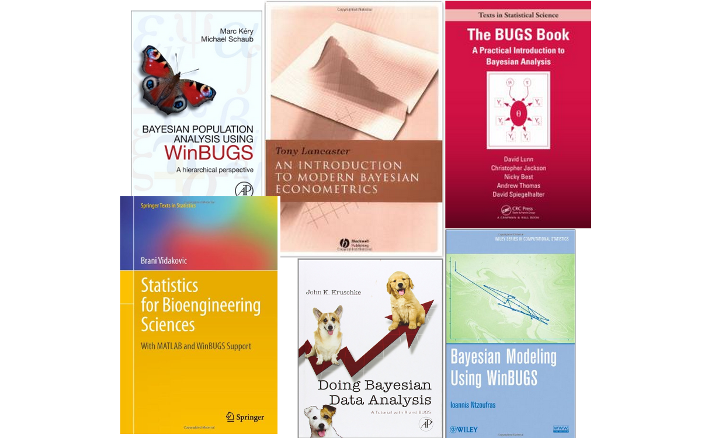

```{css, echo = FALSE}
h1, h4.author, h4.date {
  text-align: center;
}
```

```{r setup, include=FALSE, echo = FALSE}
knitr::opts_chunk$set(echo = TRUE)

knitr_opts <- list(
  message = FALSE,
  warning = FALSE,
  collapse = TRUE,
  comment = "#>",
  fig.width = 7,
  dpi = 300,
  out.width = "700px",
  fig.asp = 1 / 1.618,
  cache = FALSE,
  autodep = TRUE,
  cache.comments = TRUE,
  fig.align = "center",
  echo = TRUE,
  results = 'hide'
)
do.call(knitr::opts_chunk$set, knitr_opts)
```

## What Is NIMBLE?

- A framework for hierarchical statistical models and methods.
- An extension of the BUGS/JAGS language for:

    - writing new functions and distributions using **nimbleFunctions**
    - named alternative parameterizations (e.g. sd vs precision for `dnorm`).
    - Additional R-like coding, including vectorized declarations.
    
- A configurable system for MCMC.
- A model-generic programming system to write new analysis methods using (two-stage) nimbleFunctions.
- A growing library of other methods.
- A growing package ecosystem of other methods.
- **N**umerical **I**nference for statistical **M**odels using **B**ayesian and **L**ikelihood **E**stimation.

## The WinBUGS/OpenBUGS/JAGS language has made a huge impact on applied Bayesian statistics.



## Methods in NIMBLE beyond basic MCMC:

- Hamiltonian Monte Carlo (MCMC) (package *nimbleHMC*).
- Sequential Monte Carlo (aka particle filtering) and Particle MCMC (package *nimbleSMC*).
- Laplace approximation and adaptive Gauss-Hermite quadrature (for maximum likelihood, included in *nimble* for now, to be moved to *nimbleQuad* soon!).
- Coming soon: methods related to Integrated Nested Laplace Approximation (INLA).
- Monte Carlo Expectation Maximization (MCEM, for maximum liklihood) (included in *nimble*).
- Reversible Jump MCMC (RJMCMC) for variable selection (included in *nimble*).
- Marginal distributions for ecological models (capture-recapture, occupancy, dynamic occupancy, N-mixture, Hidden Markov models) (package *nimbleEcology*).
- Functions and distributions for spatial capture-recapture (package *nimbleSCR*).
- Conditional autoregressive (CAR) spatial models (included in *nimble*).
- Bayesian non-parametric (BNP) distributions (included in *nimble*).
- Non-stationary Gaussian processes (package *NSGP*).

## First example: Salmon Stock Recruit Models

We consider spawners counts of sockeye salmon the Fraser River. Recruits are estimated as the spawners plus the catch from that broodyear. We will start with Nadina sockeye as the example but combine multiple stocks as we progress. 

```{r}
library(tidyverse)
load("data/fraser_sockeye.Rdata")
nadina <- fraser_sockeye %>% filter(stock == "Nadina")
ggplot(nadina, aes(x = broodyear, spawners)) +
  geom_line() + 
  theme_bw()
```

We will build a Ricker stock recruit model for these data. The parameters are $r = \mbox{log}(\alpha)$, where $\alpha$ is the maximum recruits per spawner, and $E$, the unfished equilibrium population size. For brood year $i$, $S_i$ spawners generate $R_i$ recruits. Assuming combined process and observation noise $w_{i} \sim N(0,\sigma)$,

\[
  R_i = S_i \mbox{exp}\Big(r \big(1-\frac{S_i}{E}\big) + w_i\Big).
\]

We will then rewrite this as $y_i = log(R_i/S_i)$, as a linear model,

\[
  y_i = r \big(1-\frac{S_i}{E}\big) + w_i.
\]

We will now program our first NIMBLE model. Here is where you get to choose how you want to name things in your code that will be obvious to you. Decisions for the number of obsevations such as `n` or `nobs`. Whatever makes your code easy to read for yourself and others.

Note that for those that used JAGS in the past, the default `dnorm` in nimble is parameterized as `mean` and `sd`. However, it accepts `tau` as well, which is the default of JAGS. Careful when copying code between!!!

Let's think about some prior distributions. The error term, $\sigma$, is likely relatively small given that it's error on the scale of $log(R/S)$, but it is strictly positive. Log productivity $r$, `logalpha`, is not constrained but likely not mean 1. We may expect it to be around 1.5 on the log scale, but with very high uncertainty. The challenging term here is $E$, as it is potentially very large. We may scale $R$ and $S$ in advance or just work on the large scale, but our prior must reflect that it can be very large.

```{r}
library(nimble)
nadina_model_code_1 <- nimbleCode({
  # Priors
  logalpha ~ dnorm(mean = 1.5, sd = 20)
  sigma ~ dunif(0, 10)
  E ~ dhalfflat() ## This is potentially a really big number.
  
  # Likelihood:
  for( i in 1:nobs ){
    mean_logRS[i] <- logalpha*(1-S[i]/E)
    logRS[i] ~ dnorm(mean_logRS[i], sd = sigma)
  }
})
model <- nimbleModel(nadina_model_code_1,
                            constants = list(nobs = nrow(nadina), S = nadina$spawners/1000),
                            data = list(logRS = nadina$logRS))
```

We can interact with our model now run it directly in R. First we'll need to give it some initial values. If we want the model to save the values and then update, we can use `calculate` to actually run the model and return the log posterior density.

```{r}
model$logalpha <- 1.5
model$E <- 10.5
model$sigma <- 0.5
model$calculate()
```

Now let's simulate some new data given these parameters. This might be a good way to perform prior checks, or to just make sure your model makes sense.

```{r}
param_nodes <- c("logalpha", "E", "sigma")
sim_nodes <- model$getDependencies(param_nodes, self = FALSE)
model$simulate(sim_nodes, includeData = TRUE)
plot(model$logRS, nadina$logRS, xlab= "Simulated Data", ylab = "Original Data")
```

Now let's see some more about how NIMBLE stores objects. For our current model, we have explicitly define `mean_logRS`.

```{r}
model$mean_logRS
```

What if we had instead written it without the `mean_logRS` defined? In this case, NIMBLE will create a lifted node and act as if you had. It changes nothing about efficiency but makes your code slightly harder to read.

```{r}
nadina_model_code_2 <- nimbleCode({
  # Priors
  logalpha ~ dnorm(mean = 1.5, sd = 20)
  sigma ~ dunif(0, 10)
  logE ~ dhalfflat() ## This is potentially a really big number.
  
  # Likelihood:
  for( i in 1:nobs ){
    logRS[i] ~ dnorm(logalpha*(1-S[i]/E), sd = sigma)
  }
})
model <- nimbleModel(nadina_model_code_2,
                            constants = list(nobs = nrow(nadina), S = nadina$spawners/10000),
                            data = list(logRS = nadina$logRS), inits = list(logalpha = 1.5, E = 10.5, sigma = 0.5))
sim_nodes <- model$getDependencies(param_nodes, self = FALSE)
head(sim_nodes)
```

We can now fit our first model. It will compile the model into C++, then define the MCMC, compile that into C++, and then finally run the MCMC.

```{r}
samples <- nimbleMCMC(model = model)
```

This is where NIMBLE "officially" stops. It's up to you to process the posterior and assess it. A common package is `coda`.

```{r}
library(coda)
samples <- coda::mcmc(samples)
plot(samples)
```

Oh no. That's atrocious. An improper unconstrained prior on $E$ was a bad decision.

```{r}
nadina_model_code_3 <- nimbleCode({
  # Priors
  logalpha ~ dnorm(mean = 1.5, sd = 20)
  sigma ~ dunif(0, 10)
  logE ~ dnorm(2.5, 10)
  E <- exp(logE)
  
  # Likelihood:
  for( i in 1:nobs ){
    mean_logRS[i] <- logalpha*(1-S[i]/E)
    logRS[i] ~ dnorm(mean_logRS[i], sd = sigma)
  }
})
model <- nimbleModel(nadina_model_code_3,
                            constants = list(nobs = nrow(nadina), inits = list(logalpha = 1.5, logE = log(10.5), sigma = 0.5)))
  
samples <- nimbleMCMC(model = model)

samples <- coda::mcmc(samples)
plot(samples)
```

