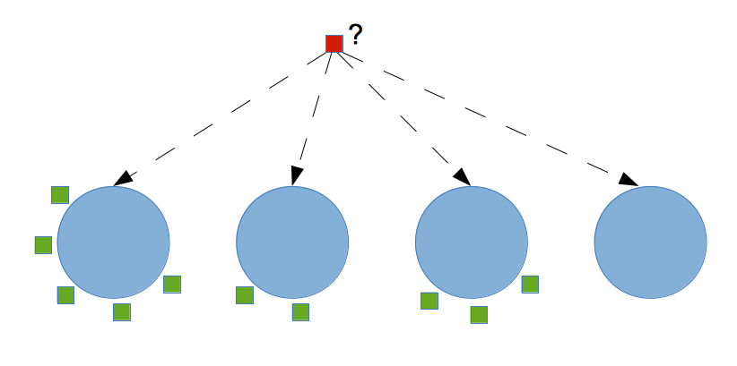

```{css, echo = FALSE}
h1, h4.author, h4.date {
  text-align: center;
}
```

```{r setup, include=FALSE, echo = FALSE}
knitr::opts_chunk$set(echo = TRUE)

knitr_opts <- list(
  message = FALSE,
  warning = FALSE,
  collapse = TRUE,
  comment = "#>",
  fig.width = 7,
  dpi = 300,
  out.width = "700px",
  fig.asp = 1 / 1.618,
  cache = FALSE,
  autodep = TRUE,
  cache.comments = TRUE,
  fig.align = "center",
  echo = TRUE,
  results = 'hide',
  eval = FALSE
)
do.call(knitr::opts_chunk$set, knitr_opts)
```

## Example Depletion Study (again)

See Module 4, improving MCMC for details about the data.

```{r, eval = TRUE}
library(tidyverse)
remdf <- read.csv("data/removal_data.csv")
catch <- remdf %>% 
  pivot_wider(id_cols = c(Site, Station, Year, Sweep), names_from = Species, 
              values_from = Fish.ID, values_fn = ~ length(.x), values_fill = 0) %>%
              pivot_longer(unique(remdf$Species), names_to = "Species", values_to = "Catch")

catch <- catch %>% group_by(Site, Station, Year, Species) %>%
  arrange(Sweep) %>%
  mutate(nCatch = cumsum(Catch)-Catch) %>%
  ungroup() %>%
  mutate(Station = as.numeric(Station))
```

## Non-parametric distributions

Mixtures of normal distributions can produce a very wide range of distributions.

Here are two examples, one with 3 modes and one with two.

```{r, eval=TRUE}
weights <- c(1, .5, .25, .125)
weights <- weights / sum(weights)
centers <- c(-1, 0, 1, 2)
sds <- c(0.5, 0.6, 0.7, 0.8)
x <- seq(-3, 4, by = 0.05)
pdf <- x |> lapply(\(x) sum(weights * dnorm(x, centers, sds))) |> unlist()
{
  plot(x, pdf, type ='l', col = "red", lwd = 1.5,
       main = "Example of normal mixture (unimodal)",
       ylim = c(0, max(c(weights, pdf))))
  for(i in seq_along(weights)) {
    points(x, weights[i] * dnorm(x, centers[i], sds[i]), type = 'l' )
    points(c(centers[i], centers[i]), c(0, weights[i]), type = 'l', col = 'blue')
  }
}
```

```{r, eval=TRUE}
weights <- c(1, .7)
weights <- weights / sum(weights)
centers <- c(-1, 1)
sds <- c(0.5, 0.7)
x <- seq(-3, 4, by = 0.05)
pdf <- x |> lapply(\(x) sum(weights * dnorm(x, centers, sds))) |> unlist()
{
  plot(x, pdf, type ='l', col = "red", lwd = 1.5,
       main = "Example of normal mixture (bimodal)",
       ylim = c(0, max(c(weights, pdf))))
  for(i in seq_along(weights)) {
    points(x, weights[i] * dnorm(x, centers[i], sds[i]), type = 'l' )
    points(c(centers[i], centers[i]), c(0, weights[i]), type = 'l', col = 'blue')
  }
}
```

We want to estimate these, by also fitting the number of modes. The number of normal distributions that make up the above distribution is part of the dimension problem. This is the challenge with these models.

See for example [Turek, Wehrhahn and Gimenez (2021). Bayesian non-parametric detection heterogeneity in ecological models.](https://link.springer.com/article/10.1007/s10651-021-00489-1)

## Bayesian estimation of non-parametric distributions

Methods are often related to a "Dirichlet process" (DP) (not the same as a Dirichlet distribution). They make use of the conjugate relationship between the assignment of an observation to a distribution via a categorical random variable, and the prior on those probabilities, a Dirichlet distribution. When we let the number of possible clusters $N \to \infty$, this is what creates a DP. Because we can have an infinite number of clusters, it is non-parametric, not possible to fully parameterize. Additionally, we models can only be Bayesian as a Frequentist approach does not allow the dimension (number of clusters) to be an uncertainty. A Frequentist might alternatively fit 100 different models each with a different number of fixed clusters, and use information criterion (e.g. AIC) to pick the model that best describes the data, thus choosing the dimension. Closely related to the DPMM is reversible jump MCMC, which is an algorithm to allow the dimension of the likelihood to flexibly switch in each iteration of the MCMC. This is particularly useful in model selection and we can see how NIMBLE examples of this here: https://r-nimble.org/nimbleExamples/RJMCMC_example.html

### Chinese restaurant process

The DP has at its core a model for clustering, which is usually called a Chinese restaurant process (CRP).

(There is also a "stick-breaking" representation that we won't show.)

Here's the idea - we represent the probability of a new customer sitting at each table as follows:

<center></center>

Under the CRP, the probability that the i'th customer sits at an unoccupied table is:

$$ \frac{\alpha}{i-1+\alpha} $$

and the probability the customer sits at table $k$ (where there are $n_k$ people already at the table) is:

$$ \frac{n_k}{i-1+\alpha} $$

- Each table represents a base distribution (e.g. a normal distribution in the mixture).
- The number of customers is related to the weight for that mixture component. (The weight is not written explicitly.)
- Each mixture component (table) gets its own group specific parameters (e.g., mean and variance).

### Fitting a CRP model

Consider the detection probabilities from the depletion study of fish via electrofishing. In this example, we placed a random effect at the site level for each detection probability.

We might instead say that we don't know which sites have the same detection probability, and which sites are different. In other words, we don't know how many unique detection probabilities there are and we also don't know which sites and species should be assigned to them. We can use a Dirichlet process mixture model (DPMM) to generate these detection probabilities and assign them to the different observations.

To do this we need a multivariate distribution on on our depletion study so we will write one similar to the one we used in module 4.

```{r}
library(nimble)
ddepletion <- nimbleFunction(
  run = function(x = double(1), prob = double(), size = double(), log = logical(0, default = FALSE)){

    ans <- 0
    Ni <- size
    for( i in seq_along(x) ){
      ans <- ans + dbinom(x[i], size = Ni, prob = prob, log=TRUE)
      Ni <- Ni - x[i]
    }
    
    returnType(double())
    if(log) 
      return(ans)
    else 
      return(exp(ans))
  }
)
```

```{r}
model_code <- nimbleCode({

  ## CRP
  z[1:nobs] ~ dCRP(alpha, size = nobs)
  alpha ~ dgamma(1, 1)
  for(i in 1:M) {
    pG[i] ~ dbeta(1,1)
  }

  lambda[1] ~ dgamma(0.1,0.1)
  lambda[2] ~ dgamma(0.1,0.1)

  for( s in 1:nstation ){
    N[s,1] ~ dpois(lambda[1])
    N[s,2] ~ dpois(lambda[2])
  }
  
  for( i in 1:nobs ){
    p[i] <- pG[z[i]]
    caught[i,1:3] ~ ddepletion(prob = p[i], size = N[station[i], spp[i]])
  }
})

## Put data in wide format:
dat92_wide <- catch %>% 
  filter(Year == 1992, Species %in% c("AS", "BT")) %>%
  pivot_wider(id_cols = c(Species, Site, Station, Year), values_from = Catch, names_from = Sweep)
caught <- do.call('cbind', dat92_wide[, c("1", "2", "3")])
data <- list(caught = caught)
constants <- list(nobs = nrow(dat92_wide), 
                  nstation = length(unique(dat92_wide$Station)), 
                  station = dat92_wide$Station, spp = as.numeric(factor(dat92_wide$Species)),
                  M = 20)
inits <- function(){
  list( N = cbind(rep(25, constants$nstation), rep(60, constants$nstation)),
        lambda = c(50, 30), z = rep(1, constants$nobs), pG = rep(0.5, constants$M))
}
Rmodel <- nimbleModel(model_code, data = data, constants = constants, inits = inits())

conf <- configureMCMC(Rmodel, monitors = c("N", "p", "z", "alpha", "lambda"))
Cmodel <- compileNimble(Rmodel)
Rmcmc <- buildMCMC(conf)
Cmcmc <- compileNimble(Rmcmc, project = Rmodel)

samples <- runMCMC(Cmcmc, niter = 10000, nburnin = 2000, nchains = 3, 
                   inits = inits(), samplesAsCodaMCMC = TRUE)
plot(samples[,c('lambda[1]', 'lambda[2]')])
```

Okay great. So what does this tell us? Do we gain any new information? Well we can recreate the abundance estimate from before.

```{r}
sumdf <- data.frame(do.call("cbind", summary(samples)))
sumdf$parameter = gsub("\\[.*", "", rownames(sumdf))
sumdf$idx = gsub("*.\\[|\\]", "", rownames(sumdf))
sumdf$Station = factor(gsub(",.*", "", sumdf$idx))
sumdf$Species = c("AS", "BT")[as.numeric(gsub("*.,", "", sumdf$idx))]
sumdf <- sumdf %>% 
  mutate(Species = ifelse(idx == "lambd1", "AS", Species)) %>%
  mutate(Species = ifelse(idx == "lambd2", "BT", Species))

ggplot(data = sumdf %>% filter(parameter == "N"), aes(x = Station, y = Mean, colour = Species)) +
  geom_point(position = position_dodge(width = 0.25)) + 
  theme_bw() + ylab("Posterior Mean Abundance") +
  geom_errorbar(aes(ymin = X2.5., ymax = X97.5., colour = Species), 
    position = position_dodge(width = 0.25), width = 0.1) +
  geom_hline(data = sumdf %>% filter(parameter == "lambda"), 
    aes(yintercept = Mean, colour= Species), linetype='dashed')

pout <- sumdf %>% filter(parameter == "p")
datp <- cbind(dat92_wide, pout[, 1:10])
ggplot(data = datp, aes(x = Station, y = Mean, colour = Species)) +
  geom_point(position = position_dodge(width = 0.25)) + 
  theme_bw() + ylab("Posterior Mean Detection Probability") +
  geom_errorbar(aes(ymin = X2.5., ymax = X97.5., colour = Species), 
    position = position_dodge(width = 0.25), width = 0.1) 
```

Now we can look at how heterogeneous the detection probability was, and how similar sites are by investigating the sampled `z`.

```{r}
out <- do.call('rbind', samples)
zcols <- grep("z\\[", colnames(out))
outz <- out[,zcols]
nGroups <- apply(outz, 1, function(x)  length(unique(x)))
hist(nGroups)
```
```{r}
pairMatrix <- apply(outz, 2, function(focal) {
                                   colSums(focal == outz)})

pairMatrix <- pairMatrix / nrow(outz)
collist <- colorRampPalette(c('white', 'grey', 'black'))


## Let's plot just BT
bt <- which(dat92_wide$Species == "BT")
as <- which(dat92_wide$Species == "AS")
n <- nrow(dat92_wide)
pairsMat_ordered <- pairMatrix[c(bt,as),c(bt, as)]
fields::image.plot(1:n, 1:n, pairsMat_ordered , col = collist(6),
           xlab = 'Station', ylab = 'Station',  axes = FALSE)
axis(1, at = 1:n, labels = rep(1:(n/2), 2), tck = -.02)
axis(2, at = 1:n, labels = rep(1:(n/2), 2), tck = -.02)
axis(3, at = 1:n, tck = 0, labels = FALSE)
axis(4, at = 1:n, tck = 0, labels = FALSE)
text(c(6,12),c(-1.75,-1.75), labels = c("Brook Trout", "Altantic Samlon"), xpd=TRUE)
text(c(-0.65,-0.65),c(6,12), labels = c("Brook Trout", "Altantic Samlon"), xpd=TRUE, srt = 90)
```

What we see is that the Atlantic salmon are more consistently the same catchability while there is much more heterogeneity in the brook trout cathcability. Site 7 is the most populous for both species which makes sense that catchability must be low for brook trout (more similar to Atlantic salmon) given how many were caught. It also highlights that our original random effect structure was not very good.

Bayesian nonparametrics are a bit scary to start but given how easy it is to implement in NIMBLE it might be worth thinking about how to use them to mop up some heterogeneity in your data.


